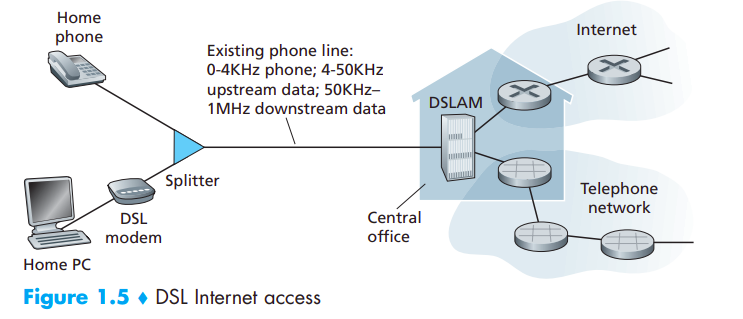
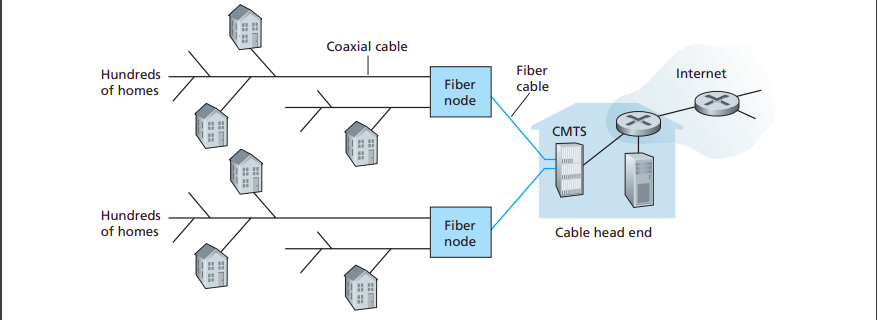
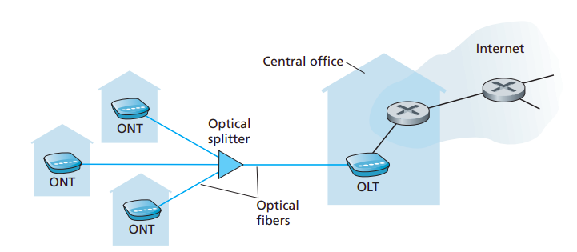

# **Chapter 1: Computer Network and the Internet**
## **1.1 What is Internet**
### **1.1.1 A Nuts-and-Bolts Description**
- **Hosts** or **end systems**: nontraditional devices that are being hooked up to the Internet
- End systems are connected together by a network of **communication links** and
**packet switches**
- Different links can transmit
data at different rates, with the **transmission rate** of a link measured in bits/second.
- **Packets** (segmented data) are then sent through the network to the destination end system, where they are reassembled
into the original data
- A packet switch (**routers** and **link-layer switches**) takes a packet arriving on one of its incoming communication links and forwards that packet on one of its outgoing communication links. 
- The sequence of communication links and packet switches from the sending end system to the receiving end system is known as a **route** or **path** through the network
- End systems access the Internet through **Internet Service Providers (ISPs)**, each ISP is in itself a network of packet switches
and communication links
- **Transmission Control Protocol (TCP)** and the **Internet Protocol (IP)** are two of
the most important protocols in the Internet. (control the sending and receiving of information within the Internet.)
- The Internet’s
principal protocols are collectively known as **TCP/IP**
-  Internet standards are developed by the Internet Engineering Task Force (IETF)[IETF 2012]. The IETF standards documents are called requests for comments (RFCs)
### **1.1.2. A Services Description**
- Internet is *an infrastructure that provides services to applications*. 
- The applications are said to be **distributed applications**, since they involve multiple end systems that exchange data with each other
- **Application Programming
Interface (API)** is a set of rules that the sending program must follow so that the Internet can deliver the data to the destination
program
### **1.1.3. What is a protocol**
- A **protocol** defines the format and the order of messages exchanged between
two or more communicating entities, as well as the actions taken on the transmission and/or receipt of a message or other event.
## **1.2. The Networking Edge**
- End systems are also referred to as *hosts* because they host (that is, run) application programs such as a Web browser program, a Web server program, an e-mail
client program, or an e-mail server program (*host = end system*)
- *hosts* are divided into 2 categories: **clients** and **servers**
  - **clients**: desktop, mobile PCs, smartphones
  - **servers**: more powerful machines that store and distribute Web pages, stream video, relay e-mail,
- Most of the servers from which we receive search results, e-mail, Web pages, and videos reside in large **data centers**
### **1.2.1. Access Network**
- Access network - the network that physically connects an end system to the first router on a path from the end system to any other distant end system.
- Today, the two most prevalent types of broadband residential access are **digital
subscriber line (DSL)** and cable

- **Hybrid fiber coax (HFC)** (using fiber and coaxial cable): While DSL makes use of the telco’s existing local telephone infrastructure, **cable Internet access** makes use of the cable television company’s existing cable television infrastructure.

- In particular, every packet sent by the head end travels downstream on every link to every home and every packet sent by a home travels on the upstream channel to the head end.
- An up-and-coming technology that promises even higher speeds is the deployment of **fiber to the home (FTTH)**

- There are two competing optical-distribution network architectures that
perform this splitting: **active optical networks (AONs)** and **passive optical networks (PONs)**
- Most FTTH ISPs provide different rate offerings, with the higher
rates naturally costing more money
#### **Access in the Enterprise (and the Home): Ethernet and Wifi**
- Although there
are many types of LAN technologies, Ethernet is by far the most prevalent access
technology in corporate, university, and home networks
